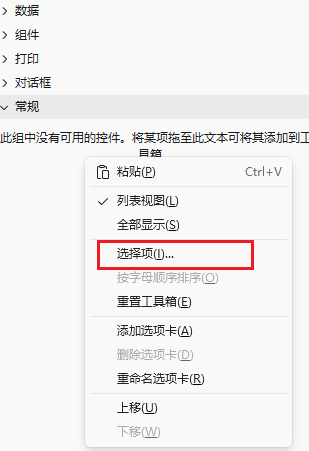
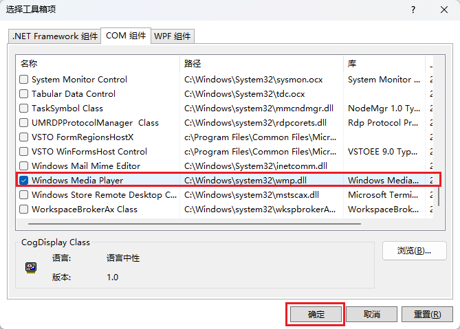
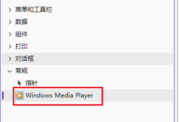
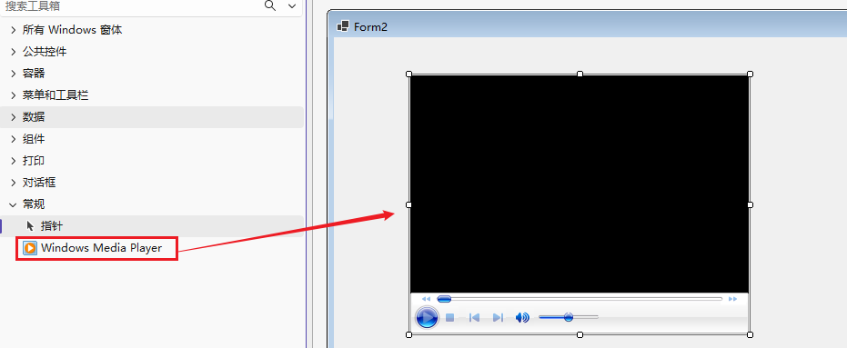

# day07

## 一、上节回顾

### 窗体操作

- 操作方法: `Show/Hide/ShowDialog/Close` `Application.Exit`

### 用户控件

> 自动控件, 当多个控件有相同结果内容时候,可以使用用户控件自定义

#### 控件通信

- 父子通信:  父容器使用子控件的时候, 可以给子控件通过子控件的属性传递数据
- 子父通信: 在子控件中定义好 事件属性(值是函数类型), 并可以通过 `Invoke`调用时传递数据
  - 在父控件中, 通过子控件实例给对应事件属性 绑定处理方法(委托) , 方法是父容器的方法

## 二、线程操作

### 1、进程和线程

每个应用程序运行，都需要消耗内存和CPU，以及信号、权限等等信息，也就是操作系统给这个程序分配的资源。我们把这部分资源叫做进程。所以我们在查看任务管理器的时候，能看到很多正在运行的程序的**进程**。

进程和进程之间是相互隔离的，互不影响，所以关闭一个程序，正常不会影响到另一个程序。

假设我们浏览器是一个进程。浏览器需要同时做很多事情：加载网页文字、加载图片、播放视频、响应鼠标点击。

 如果一个进程里面，只能有一条顺序执行路径，所有事情就要排队挨个执行：先加载文字，文字加载完再加载图片，图片好了再播放视频。一旦网络卡顿，加载图片卡住，整个浏览器界面直接卡死，无法点击。

效率太低！操作系统想出方案：允许一个进程内部，分出多条独立同时执行的执行流程，这就是**线程**。

假设一桌（进程）资源共享：桌子、餐具全部共用；同一桌可以安排多个服务员（多条线程）同时干活。

例如：

操作系统==>餐厅

进程==>一整桌客人吃饭的客人

线程==>餐桌上干活的服务员

服务员 A 负责上菜（加载文字）、服务员 B 负责倒水（加载图片）、服务员 C 负责清理桌面（响应交互）。 一个服务员卡住，其他服务员依旧可以正常工作。

线程是进程内CPU调度的一个工作流。

### 2、线程操作

为什么要学习线程？我们开发项目的时候，程序运行起来，系统会给这个程序分配一个进程，为了提高这个项目的运行效率，我们给这个进程分配多个线程，让每个线程负责运行其中一部分代码，每个线程都是独立的，互不影响，这样可以提高执行效率。

每个线程都可以共享进程中的变量、内存、文件资源，所以有的线程是独立运行的，有的线程可能就需要依赖其他线程，所以我们需要学会如何操作线程。

我们csharp项目，默认只有一个主线程在工作，也就意味着，同一时间，只能做一件事，后续的事情需要等上面的事情做完后才能继续，如果有一些比较耗时的操作，就可以单独开辟一个线程，将这个操作交给这个线程，可以大大提高项目的运行效率。

### 3、语法

- 查看当前线程

  ```c#
  Thread.CurrentThread
  ```

  

- 查看/设置线程名称

  ```c#
  线程实例.Name
  ```

- 查看线程id

  ```c#
  线程实例.ManagedThreadId
  ```

  > 结果是int

- 创建线程

  ```c#
  // 方式1：无参数线程
  Thread t1 = new Thread(函数);
  ```

- 启动线程

  ```c#
  线程实例.Start(参数?);
  ```

  > 注意：启动线程给函数带参数时，这个函数的参数类型必须是object，返回值必须是void；没有参数时，函数返回值是void

  例：

  ```c#
  static void Main()
  {
      Thread NThread = new Thread(ForTest);
      NThread.Start(10000);
  }
  private static void ForTest(object num)
  {
      int sum = 0;
      for(int i = 0; i < (int)num; i++)
      {
          sum += i;
      }
      MessageBox.Show(sum.ToString());
  }
  ```

  

- 线程休眠

  ```c#
  Thread.Sleep(毫秒数); 
  ```

  例：

  ```c#
  MessageBox.Show("aa");
  Thread.Sleep(2000);
  MessageBox.Show("bb");
  ```

  

- 线程等待

  ```c#
  线程实例.Join();
  // 带超时：最多等待3秒
  线程实例.Join(3000);
  ```

  > 让当前线程等待这个线程运行结束再继续

  例1：

  ```c#
  static void Main()
  {
      Thread NThread = new Thread(ForTest);
      NThread.Start();
      NThread.Join();
      MessageBox.Show("bb");
  }
  private static void ForTest()
  {
      int sum = 0;
      for(int i = 0; i < 100; i++)
      {
          sum += i;
      }
      Thread.Sleep(3000);
      MessageBox.Show(sum.ToString());
  }
  ```

  例2：

  ```c#
  static void Main()
  {
      Thread NThread = new Thread(ForTest);
      NThread.Start();
      NThread.Join(100);
      MessageBox.Show("bb");
  }
  private static void ForTest()
  {
      int sum = 0;
      for(int i = 0; i < 50000; i++)
      {
          sum += i;
      }
      Thread.Sleep(3000);
      MessageBox.Show(sum.ToString());
  }
  ```

  

- 查看线程状态

  ```c#
  线程实例.ThreadState
  ```

  > 结果是枚举类型：
  >
  > `Unstarted`：实例创建，还没调用 `Start()`
  >
  > `Running`：正常运行
  >
  > `WaitSleepJoin`：Sleep、Join、等待锁，处于阻塞
  >
  > `Stopped`：线程执行完成

  例：

  ```c#
  static void Main()
  {
      Thread NThread = new Thread(ForTest);
      MessageBox.Show("1--" + NThread.ThreadState.ToString()); // Unstarted
      NThread.Start();
      Thread.Sleep(3000);
      MessageBox.Show("4--" + NThread.ThreadState.ToString()); // WaitSleepJoin
      NThread.Join();
      MessageBox.Show("5--" + NThread.ThreadState.ToString()); // Stopped
  }
  private static void ForTest()
  {
      int sum = 0;
      for(int i = 0; i < 50000; i++)
      {
          sum += i;
      }
      MessageBox.Show("2--" + Thread.CurrentThread.ThreadState.ToString()); // Running
      Thread.Sleep(8000);
      MessageBox.Show("3--" + Thread.CurrentThread.ThreadState.ToString()); // Running
      MessageBox.Show(sum.ToString());
  }
  ```

  

- 查看/设置线程是否后台

  ```c#
  线程.IsBackground // 布尔值
  ```

  > 后台线程：所有前台线程退出，进程直接关闭，后台线程被强行终止
  >
  > 前台线程：进程必须等待所有前台线程结束才能退出

  例：

  ```C#
  private void button1_Click(object sender, EventArgs e)
  {
      var t2 = new Thread(ShowOther);
      t2.IsBackground = false;
      t2.Start();
  }
  
  private void ShowOther()
  {
      Thread.Sleep(8000);
      var t1 = Thread.CurrentThread;
      MessageBox.Show(t1.IsBackground.ToString());
  }
  ```

  > 结合任务管理器查看

- 查看/设置线程优先级

  ```c#
  线程.Priority // ThreadPriority 枚举类型
  ```

  > `Lowest` < `BelowNormal` < `Normal`(默认) < `AboveNormal` < `Highest`
  >
  > 多个线程争抢同一颗 CPU，高优先级线程获得 CPU 时间片的概率更高，有效运算时间更长。

  例：

  ```c#
  private void button1_Click(object sender, EventArgs e)
  {
      var t2 = new Thread(ShowOther);
      t2.Priority = ThreadPriority.BelowNormal;
      t2.IsBackground = true;
      t2.Start("低优先级线程：");
      var t3 = new Thread(ShowOther);
      t3.Priority = ThreadPriority.AboveNormal;
      t3.IsBackground = true;
      t3.Start("高优先级线程：");
  }
  private void ShowOther(object tip)
  {
      int sum = 0;
      for(int i = 0;  i < 100000000; i++)
      {
          sum += i;
      }
      MessageBox.Show(tip.ToString() + sum.ToString());
  }
  ```

  > 注意：任务太过简单的话，基本用不到多线程，看到的效果不是很明显

- 查看线程是否活动状态

  ```c#
  线程.IsAlive
  ```

  > 结果是布尔值，活动状态表示线程已经启动，还没执行结束，不活动时是没启动或已经运行结束

  例：

  ```c#
  private void button1_Click(object sender, EventArgs e)
  {
      var t2 = new Thread(ShowOther);
      t2.Start();
      Thread.Sleep(2000);
      MessageBox.Show("1---" + t2.IsAlive.ToString());
  }
  private void ShowOther()
  {
      MessageBox.Show("2---" + Thread.CurrentThread.IsAlive.ToString());
  }
  ```

  

### 4、线程池

每次创建线程，都要重新开辟内存，执行结果就销毁。如果操作比较频繁或大量出现线程，容器混乱、性能暴跌、卡死。线程池就是用来解决这个问题的。

程序需要执行短任务时，直接拿池子里空闲线程执行；任务完成，线程不会销毁，归还池中等待下一个任务，实现线程复用。

例如：

线程操作==> 每次业务来了临时招临时工，干完直接开除；招人、辞退成本很高。

线程池==>固定一批员工常驻待命，任务来了安排人手，做完员工留下等待下一个工作，不用反复招人。

语法：

```c#
// 方式1：无入参任务
ThreadPool.QueueUserWorkItem(state =>
{
    Console.WriteLine($"线程池线程执行，ID：{Thread.CurrentThread.ManagedThreadId}");
});

// 方式2：传递参数
ThreadPool.QueueUserWorkItem(state =>
{
    int num = (int)state;
    Console.WriteLine($"传入参数：{num}");
}, 100);
```

修改最大并发量：

```c#
// 获取配置：最小工作线程、最大工作线程、最小IO线程、最大IO线程
ThreadPool.GetMinThreads(out int minWork, out int minIO);
ThreadPool.GetMaxThreads(out int maxWork, out int maxIO);

// 修改最大并发数量（谨慎使用，一般不建议随意修改默认值）
ThreadPool.SetMaxThreads(20, 20);
ThreadPool.SetMinThreads(4,4);
```

> 两种线程：
>
> - **工作线程（Worker Thread）**：普通 CPU 计算任务，默认的最小工作线程跟计算机CPU配置有关
> - **IO 完成线程（IOCP）**：专门处理文件、网络、数据库这类 IO 阻塞操作

例：

```c#
private void button1_Click(object sender, EventArgs e)
{
    ThreadPool.QueueUserWorkItem(state =>
    {
        Thread.Sleep(2000);
        label1.Text = ($"线程池线程执行，ID：{Thread.CurrentThread.ManagedThreadId}");
    });
    ThreadPool.QueueUserWorkItem(state =>
    {
        Thread.Sleep(2000);
        label2.Text = ($"线程池线程执行，ID：{Thread.CurrentThread.ManagedThreadId}");
    });
    ThreadPool.GetMinThreads(out int minWork, out int minIO);
    ThreadPool.GetMaxThreads(out int maxWork, out int maxIO);
    label3.Text = "最小工作线程数：" + minWork;
    label4.Text = "最小IO线程数：" + minIO;
    label5.Text = "最大工作线程数：" + maxWork;
    label6.Text = "最大IO线程数：" + maxIO;
}
```


## 三、Task

### 1、概念

通过对比，我们发现线程池的性能会比手动创建线程效率更高一些。

但线程池无法获取到线程执行的结果，没有便捷的方法等待一批任务。所以新版`.Net`有了Task概念，让系统自动分配线程池执行任务。

例如：我们用一个新线程在另一个窗体的某个容器控件中，调用了当前窗体中的某个方法，想要获取到这个线程结束后的某个数据，做起来非常麻烦，需要用到跨控件通信。Task能让我们在调用的位置直接获取到调用的结果。

例如：

- Thread：直接招聘一名正式工人
- ThreadPool：一批常驻工人
- Task：提交工作需求，系统自动安排空闲工人去完成

Task强调的是任务，不再关注线程，底层会自动分配。

### 2、语法

- 创建和执行任务： 

  ```c#
  // 无返回值任务1，如果任务需要传递参数，可以通过() => {}方式包裹进行传递
  Task task = Task.Run(() =>
  {
      
  });
  
  // 无返回值任务2，如果任务函数需要传递参数，可以在函数后通过参数传递
  Task task = new Task(() =>
  {
     
  });
  task.Start(); // 这种创建任务的方式必须手动启动
  
  // 带返回值任务，有返回值
  Task<数据类型> task = Task.Run(() =>
  {
      return 结果;
  });
  ```

  例：Task也是开辟新的线程

  ```c#
  Task.Run(() =>
  {
      MessageBox.Show("里面：" + Thread.CurrentThread.ManagedThreadId.ToString());
  });
  MessageBox.Show("外面：" + Thread.CurrentThread.ManagedThreadId.ToString());
  ```

  > 结果得到两个不同的线程id，可以得出结论：Task开辟了新的线程

- 执行带返回值任务获取到返回值

  ```c#
  Task实例.Result;
  ```

  > 注意：`.Result` 会阻塞线程，UI 线程慎用，容易卡死界面。

  例：

  ```c#
  private void button1_Click(object sender, EventArgs e)
  {
      Task<int> task = Task<int>.Run(()=>ShowOther());
      MessageBox.Show(task.Result.ToString());
  }
  private int ShowOther()
  {
      int num = 10;
      return num;
  }
  ```

  例：参数传递方式

  Run方式传递：

  ```c#
  private void button1_Click(object sender, EventArgs e)
  {
      Task<int> task = Task<int>.Run(() => ShowOther(1, 2));
      MessageBox.Show(task.Result.ToString());
  }
  private int ShowOther(int a, int b)
  {
      return a + b;
  }
  ```

  new方式传递：

  ```c#
  private void button1_Click(object sender, EventArgs e)
  {
      Task<int> task = new Task<int>(ShowOther, (1, 2));
      MessageBox.Show(task.Result.ToString());
  }
  private int ShowOther(object obj)
  {
      var tuple = (Tuple<int, int>)obj;
      var (a, b) = tuple;
      return a + b;
  }
  ```

  > Result会导致窗体卡死

- 等待任务执行

  ```C#
  Task实例.Wait();
  ```

  > 作用等同于 Thread.Join ()，阻塞当前线程，等待任务完成

  例：

  ```c#
  private void button1_Click(object sender, EventArgs e)
  {
      Task<int> t = Task.Run(() =>
      {
          Thread.Sleep(3000);
          MessageBox.Show("正在运行中。。。");
          return 100;
      });
  
      MessageBox.Show("开始等待");
      t.Wait();  // 等待Task的线程执行结束
      MessageBox.Show("等待结束");
  }
  ```

  > 通过等待与不等待看结果

- 批量监视多任务执行 

  ```c#
  Task[] tasks = new Task[3];
  for (int i = 1; i <= 3; i++)
  {
      int num = i;
      tasks[i - 1] = Task.Run(() =>
      {
          Thread.Sleep(num * 1000);
          MessageBox.Show($"任务{num}运行");
      });
  }
  Task.WhenAll(tasks).Wait();
  MessageBox.Show("所有任务完成");
  ```

  > 一般用来等待所有任务执行结束，WhenAll不是启动任务，不是等待，只是**监视批量任务**

- 批量任务只要有一个结束 

  ```c#
  Task[] tasks = new Task[3];
  for (int i = 1; i <= 3; i++)
  {
      int num = i;
      tasks[i - 1] = Task.Run(() =>
      {
          Thread.Sleep(num * 1000);
          MessageBox.Show($"任务{num}运行");
      });
  }
  Task.WhenAny(tasks).Wait();
  MessageBox.Show("有一个任务完成");
  ```

  

- 连续任务：上一个任务结束立刻执行第二个任务

  不带返回值：

  ```c#
  Task t1 = Task.Run(() =>
  {
      MessageBox.Show("前置任务");
      Thread.Sleep(1000);
  });
  t1.ContinueWith((Task Prev) =>
  {
      MessageBox.Show("后置任务");
  });
  ```

  带返回值：

  ```c#
  Task<string> t1 = Task.Run(() =>
  {
      return "前置任务结果";
  });
  t1.ContinueWith((Task<string> Prev) =>
  {
      MessageBox.Show(Prev.Result.ToString()); // 接收前置任务结果
  });
  ```

  接收连续任务结果：

  ```c#
  Task<int> t1 = Task.Run(() =>
  {
      int num = 10;
      return num;
  });
  Task<int> t2 = t1.ContinueWith((Task<int> Prev) =>
  {
      return Prev.Result % 3;
  });
  MessageBox.Show(t2.Result.ToString()); // 连续任务的结果
  ```

  ContinueWith方法有第二个参数，可以根据不同的情况处理任务：

  > OnlyOnRanToCompletion：前置任务正常顺利完成，才执行延续任务
  >
  > OnlyOnFaulted：仅前置任务抛出异常才执行（用来统一处理异常）
  >
  > OnlyOnCanceled：仅前置任务被取消才执行
  >
  > NotOnRanToCompletion：异常 或 取消时执行，正常完成不执行
  >
  > ExecuteSynchronously：延续任务尽量同步执行，不新开线程池线程

  例：常用异常处理

  ```c#
  bool IsError = false;
  Task<int> t1 = Task.Run(() =>
  {
      if (IsError)
      {
          throw new Exception("错误");
      }
      
      int num = 10;
      return num;
  });
  Task<string> t2 = t1.ContinueWith((Task<int> Prev) =>
  {
      if (Prev.Exception != null)
      {
          return Prev.Exception.InnerException.Message;
      }
      int result = Prev.Result % 3;
      return result.ToString();
  });
  MessageBox.Show(t2.Result); // 连续任务的结果
  ```

  

- 任务状态

  ```c#
  Task实例.Status // 获取任务状态枚举类型
  ```

  > `Created`：创建未启动（new Task 才会出现）
  >
  > `WaitingToRun`：等待线程池分配线程执行
  >
  > `Running`：正在执行
  >
  > `RanToCompletion`：正常顺利执行完毕
  >
  > `Faulted`：任务发生异常
  >
  > `Canceled`：任务被取消

  例：

  ```c#
  Task t1 = new Task(() =>
  {
      Thread.Sleep(2000);
      MessageBox.Show("Task任务");
  });
  MessageBox.Show(t1.Status.ToString()); // Created
  t1.Start();
  MessageBox.Show(t1.Status.ToString()); // WaitingToRun
  Thread.Sleep(1000);
  MessageBox.Show(t1.Status.ToString()); // Running
  Thread.Sleep(2000);
  MessageBox.Show(t1.Status.ToString()); // RanToCompletion
  ```

  取消任务和取消任务的状态： 

  ```c#
  CancellationTokenSource cts = new CancellationTokenSource();
  Task t1 = Task.Run(() =>
  {
      Thread.Sleep(4000);
      MessageBox.Show("Task任务");
  }, cts.Token);
  cts.Cancel();
  MessageBox.Show(t1.Status.ToString()); // Canceled
  ```

  任务异常状态：

  ```c#
  Task t1 = Task.Run(() =>
  {
      throw new Exception("错误");
  });
  Thread.Sleep(500);
  MessageBox.Show(t1.Status.ToString()); // Faulted
  ```

  

### 3、async和await

Task任务在开发使用过程中，碰到不同的场景有不同的使用方式，也会产生不同的问题：

- `.Result`阻塞线程会失去多线程的特性
- `ContinueWith `会导致回调地狱，影响后续的阅读和维护
- 异常处理无法使用`try catch`，只能在回调函数中抛出，不利于异常处理

`c#`提供了`async await`语法，用来处理上述问题。

使用语法：

- async和await要配合使用，await必须用在被async修饰的函数中
- async修饰的函数，返回值只有三种：`void`、`Task`、`Task<T>`
- await后面只能跟`Task`、`Task<T>`
- await的含义是等待一个Task任务的返回值，不会阻塞线程，是暂停当前方法执行，交出线程，等到结果后，再恢复继续执行

例：使用语法

```c#
private async void button1_Click(object sender, EventArgs e)
{
    // 等待接收Task结果
    string res = await ShowOther();
    MessageBox.Show(res);
    MessageBox.Show("结束");
}
private async Task<string> ShowOther()
{
    await Task.Run(() =>
    {
        MessageBox.Show("ShowOther任务开始");
        Thread.Sleep(3000);
    });
    // 等待任务结束
    return "ShowOther任务结束";
}
```

例：不阻塞线程

```c#
private void button2_Click(object sender, EventArgs e)
{
    label1.Text = "await 不占用线程";
}
private async void button1_Click(object sender, EventArgs e)
{
    // 等待接收Task结果
    string res = await ShowOther();
    MessageBox.Show(res);
    MessageBox.Show("结束");
}
private async Task<string> ShowOther()
{
    await Task.Run(() =>
    {
        MessageBox.Show("ShowOther任务开始");
        Thread.Sleep(3000);
    });
    // 等待任务结束
    return "ShowOther任务结束";
}
```

button1_Click中执行到await的时候，button2_Click是可以执行的。

例：阻塞与不阻塞的区别：

```c#
private async void button1_Click(object sender, EventArgs e)
{
    label1.Text = "开始等待";
    // await 不阻塞UI线程，窗口可以拖动、按钮可以点击
    await Task.Delay(3000);
    label1.Text = "等待完成";
}

private void button2_Click(object sender, EventArgs e)
{
    label1.Text = "开始等待";
    // .Wait() 阻塞UI线程！窗口直接卡死，无法拖动
    Task.Delay(3000).Wait();
    label1.Text = "等待完成";
}
```


## 四、音视频播放

### 1、Windows Media Player

#### 1.1、控件创建

利用windows内置的windows media player，适合简单播放 mp3、wav、mp4、avi，依赖系统 WMP 播放器。

添加控件：

1. 工具箱 → 右键【选择项】→【COM 组件】→【勾选 **Windows Media Player** → 确定

    

    

2. 工具箱上会显示这个控件

    

3. 拖入窗体

    

4. 设置媒体路径，控制媒体播放等功能

   ```c#
   public Form2()
   {
       InitializeComponent();
       // 控件创建依赖窗体，要在窗体的Load事件或Shown窗口中，建议放在Shown事件中
       this.Shown += this_Shown;
   }
   
   private void this_Shown(object sender, EventArgs e)
   {
       // 设置播放路径
       axWindowsMediaPlayer1.URL = @"./media/thmfb.mp4";
   }
   ```

   默认会自动播放。

#### 1.2、控制媒体

- 设置关闭自动播放

  ```c#
  axWindowsMediaPlayer1.settings.autoStart = false;
  ```

  

- 播放

  ```c#
  axWindowsMediaPlayer1.Ctlcontrols.play();
  ```

  

- 暂停

  ```c#
  axWindowsMediaPlayer1.Ctlcontrols.pause();
  ```

  

- 停止

  ```c#
  axWindowsMediaPlayer1.Ctlcontrols.stop();
  ```

  

- 设置音量

  ```c#
  axWindowsMediaPlayer1.settings.volume = 70; // 音量 0~100
  ```

  

- 画面模式

  ```c#
  axWindowsMediaPlayer1.uiMode = 值;
  ```

  > 取值：
  >
  > full：完整控制条
  >
  > mini：简化版控制条
  >
  > none：只有画面，没有控制条
  >
  > invisible：没有画面，也没有控制条

#### 1.2、事件操作

- 播放状态改变时触发

  ```c#
  axWindowsMediaPlayer1.PlayStateChange += axWmp_PlayStateChange;
  private void axWmp_PlayStateChange(object sender, AxWMPLib._WMPOCXEvents_PlayStateChangeEvent e)
  {
      int state = e.newState;
      switch (state)
      {
          case 1:
              MessageBox.Show("停止");
              break;
          case 2:
              MessageBox.Show("暂停");
              break;
          case 3:
              MessageBox.Show("播放");
              break;
          case 9:
              MessageBox.Show("缓冲中");
              break;
          case 8:
              MessageBox.Show("结束"); // 如果需要下一首或循环播放写在这里
              break;
      }
  }
  ```

  

- 播放进度条改变时触发(手动改变播放进度条)

  ```c#
  axWindowsMediaPlayer1.PositionChange += axWmp_PlayStateChange;
  private void axWmp_PlayStateChange(object sender, AxWMPLib._WMPOCXEvents_PositionChangeEvent e)
  {
      double currentSec = e.newPosition; // 当前播放位置,单位：秒
      MessageBox.Show(currentSec.ToString());
  }
  ```

  

- 播放出错时触发

  ```c#
  axWindowsMediaPlayer1.ErrorEvent += error_Start;
  private void error_Start(object sender, EventArgs e) // 当播放器整体发生错误时触发，例如播放路径错误
  {
      IWMPError errorObj = axWindowsMediaPlayer1.Error;
      IWMPErrorItem err = errorObj.get_Item(0);
      MessageBox.Show($"错误码：{err.errorCode}\n信息：{err.errorDescription}");
  }
  ```

  

### 2、SoundPlayer（原生 .NET）

适合只播放音频，不需要要窗口的场景（一般用于背景音乐），只能支持wav格式：

```c#
SoundPlayer sp = new SoundPlayer(@"./media/qrm.wav");
sp.Play();       // 异步后台播放
sp.PlaySync();   // 阻塞
sp.Stop();
```

小任务：安装PHPStudy（安装路径不要包含中文和空格）；安装Navicat（记得取消流氓软件）

## 五、Mysql

数据库操作，我们平常项目中的数据都来源于数据库，Mysql是比较常用的数据库。

`C#`中操作Mysql数据库需要依赖第三方库：MySqlConnector。

### 1、连接数据库，并查询数据

- 定义连接字符串

  ```c#
  string ConnStr = "server=127.0.0.1;port=3306;database=novel_db;uid=root;pwd=root;charset=utf8";
  ```

  

- 创建连接对象 `MySqlConnection`，传入连接字符串

  ```c#
  // 使用using可以自动关闭连接，否则还需要手动关闭
  using (MySqlConnection MysqlConn = new MySqlConnection(ConnStr)){}
  ```

  

- 打开连接，可以是同步的，但如果不想阻塞线程，可以使用异步

  ```c#
  MysqlConn.Open();
  await MysqlConn.OpenAsync();
  ```

  

- 创建命令对象 `MySqlCommand`，绑定 SQL 语句与连接

  ```c#
  // 定义查询语句
  string sql = "select * from Table";
  // 定义命令行对象
  using (MySqlCommand Cmd = new MySqlCommand(sql, MysqlConn)){}
  ```

  

- 使用适配器 `MySqlDataAdapter` 填充 DataTable

  ```c#
  MySqlDataAdapter Adapter = new MySqlDataAdapter(Cmd);
  DataTable dt = new DataTable();
  Adapter.Fill(dt);
  ```

  

- 使用数据

  ```c#
  dataGridView1.DataSource = dt;
  ```

> 如果sql语句中有数据，可以在sql语句中占位，然后使用MySqlCommand实例对象，填充数据，例：
>
> ```c#
> // string sql = "select * from users where username=@username";
> Cmd.Parameters.AddWithValue("@username", "user1");
> ```

### 2、增删改操作

```c#
using (MySqlCommand Cmd = new MySqlCommand(sql, MysqlConn))
{
    Cmd.Parameters.AddWithValue("@username", "user3");
    Cmd.Parameters.AddWithValue("@password", "123123");
    Cmd.Parameters.AddWithValue("@nickname", "abc");
    int rows = Cmd.ExecuteNonQuery(); // 受影响的行数
    label1.Text = rows.ToString();
}
```

> 执行方法可以使用异步的：
>
> ```c#
> await MySqlCommand.ExecuteNonQueryAsync();
> ```


### 3、MySqlCommand方法

- 执行增删改sql语句：

  ```c#
  ExecuteNonQuery()
  ExecuteNonQueryAsync()
  ```

  

- 读取第一行数据或聚合结果

  ```c#
  ExecuteScalar()
  ExecuteScalarAsync()
  ```

  例：

  ```c#
  string sql = "select count(*) from users";
  using (MySqlCommand Cmd = new MySqlCommand(sql, MysqlConn))
  {
      object result = Cmd.ExecuteScalar();
      label1.Text = result.ToString();
  }
  ```

  

- 获取Reader

  ```c#
  ExecuteReader()
  using var reader = await cmd.ExecuteReaderAsync()
  ```

  

### 4、MySqlDataReader方法

- 获取列数

  ```c#
  reader.FieldCount
  ```

  

- 是否至少有一行结果数据

  ```c#
  reader.HasRows;
  ```

  

- 读取数据

  ```c#
  bool hasRow = reader.Read();
  bool hasRow = await reader.ReadAsync();
  ```

  > 返回的布尔值代表是否读到数据

- 获取数据

  ```c#
  // 按字段下标取值，需要指定数据类型
  reader.GetInt32(0); 
  reader.GetString(1);  
  reader.GetDouble(2);
  reader.GetDateTime(3); // 日期
  reader.GetBoolean(4);
  
  // 按字段取值
  reader.GetInt32("id");
  reader.GetString("name");
  ```

  

