# day06

## 一、上节回顾

#### 选中项改变事件

- 下拉框.SelectedIndexChanged  事件
  - 下拉框.SelectedIndex 选中项下标
  - 下拉框.SelectedItem  选中项内容
- 复选框.CheckStateChanged     事件监测三种状态变化都触发事件
  - 复选框.Checked     获取复选框的选中状态  true/false
  - 复选框.CheckState    获取复选框的选中状态  三个枚举值 
    - CheckState.Checked                     选中
    - CheckState.UnChecked                为勾选
    - CheckState.Indeterminate         半选
- 复选框.CheckedChanged        事件监测复选框的true/false状态变化

#### 坐标转换操作

- `控件.PointToScreen(坐标)`
  - 返回Point坐标,  将原坐标转为 相对于 屏幕的坐标

- `容器.PointToClient(坐标)`
  - 返回Point坐标, 将原坐标转为 相对于 容器的坐标
- `坐标.Offset(X变化,Y变化)`  快速运算坐标

#### 窗体方法

- `窗体实例.Show()`  显示
- `窗体实例.Hide()`  隐藏
- `窗体实例.Close()`  关闭
- `Application.Exit()` 退出应用


## 一、窗体操作

### 3、窗体事件

| 事件          | 触发时机                     | 场景                                   |
| ------------- | ---------------------------- | -------------------------------------- |
| `Load`        | 窗体第一次加载显示前执行     | 初始化数据、给控件赋值，**只执行一次** |
| `Shown`       | 窗体已经显示出来之后         | 窗体完全渲染完成后执行                 |
| `FormClosing` | 窗体正在关闭（可以取消关闭） | 关闭前弹窗确认是否退出                 |
| `FormClosed`  | 窗体已经关闭完成             | 释放资源、打开其他窗体                 |
| `Resize`      | 窗体大小改变                 | 窗口缩放，适配控件布局                 |


## 二、第三方库

winform默认布局的控件，相对来说是比较丑的。有些开源库，里面将默认的控件，做了封装，变得漂亮，我们可以使用这种开源的库，对界面进行布局。

### 下载安装：

在解决方案下面文件夹上右击：

 

 

 

 

 

 

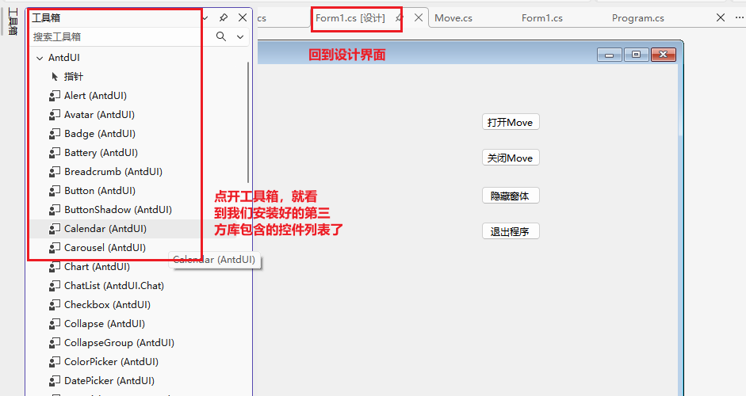 

AntdUI使用的时候，跟默认的控件使用方式是一样的。

参考网站：https://gitee.com/AntdUI/AntdUI/blob/main/doc/wiki/zh/Control/Input.md


### 作业图书新增界面

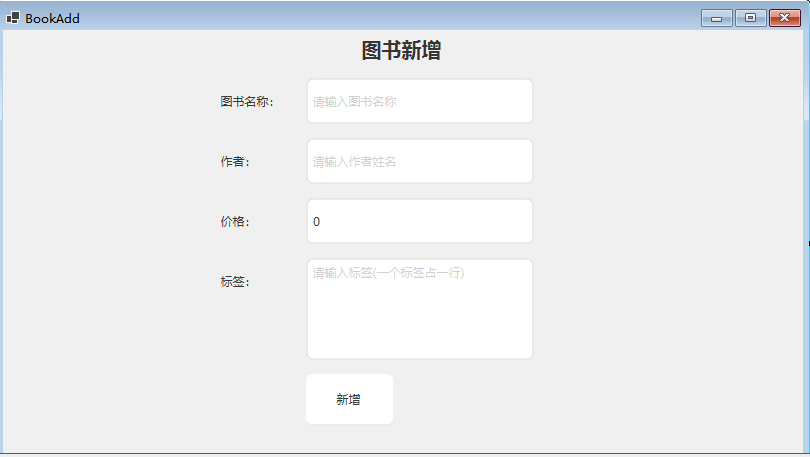 

> 图书新增界面和编辑界面
>
> 要求:  将新增和编辑界面的公共内容提取 使用 用户控件 实现


## 三、用户控件

当我们在项目中，有多处公共的布局时，为了减少重新布局的动作，可以将这部分公共的布局进行封装。此时就需要用到用户控件。

使用步骤：

- 创建用户控件

  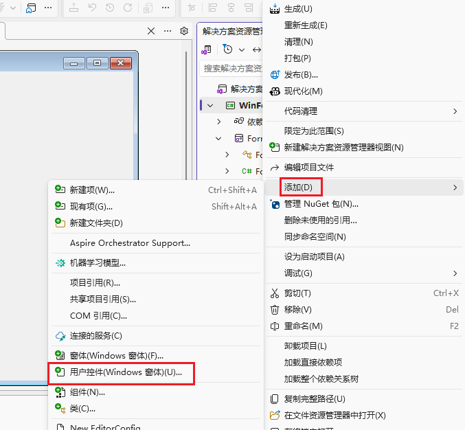 

  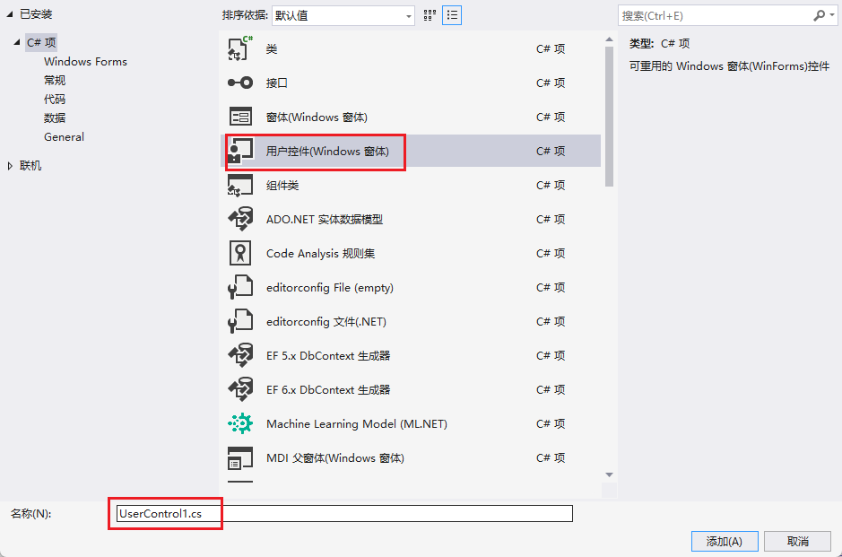 

  控件生成后，会生成一个类似于Form1的设计界面和代码，我们可以在设计界面设计这个用户控件。

  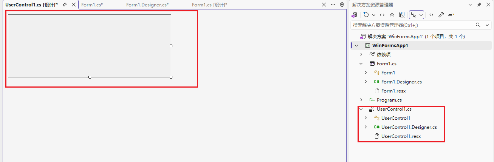  

- 设计自定义布局

  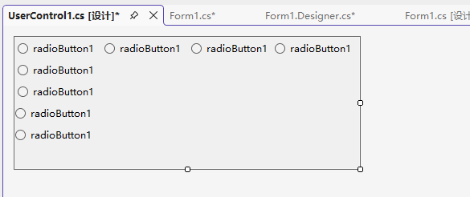 

- 生成解决方案

  设计好以后，我们需要在解决方案右击，点击生成解决方案：

  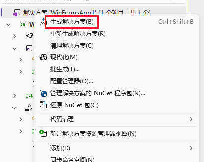 

- 在界面中使用用户控件

  当我们再使用这种布局的时候，就可以从工具箱中找到这个控件了，直接拖拽进来就能使用：

  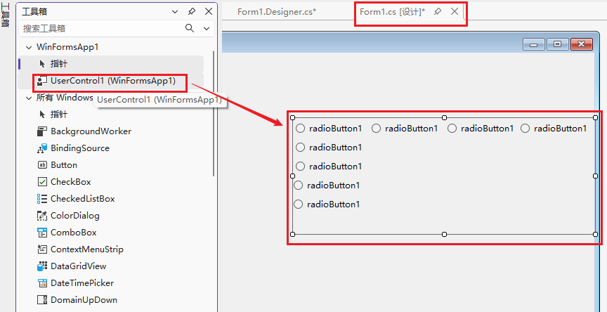 

所以，用户控件其实就是将一部分的布局和逻辑进行封装的一种**自定义控件**。

## 四、控件通信

### 1、父子通信

通过窗体找到子控件，设置他的属性，调用他的方法。

子控件放在父控件中的时候，经过了实例化，我们在父控件的代码中，在new的时候给子控件设置属性值 ==> 父给子传递数据。

### 2、子父通信

- 父控件中给子控件绑定自定义事件，定义好事件函数，设置好参数，参数就是要接收的值。

  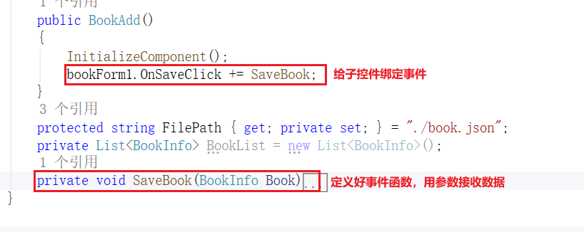 

- 子控件定义事件函数为自己的属性，设置好类型event（子控件给自己定义，允许绑定一个指定名称的自定义事件）

  ```c#
  internal event Action<BookInfo> OnSaveClick;
  ```

  > 指定事件名称，指定事件函数的类型

- 子控件在需要的时候，使用Invoke触发这个事件

  ``` c#
  OnSaveClick?.Invoke(Book);
  ```

- 父控件在定义好的函数中，接收到数据处理逻辑


### 3、非父子通信

- 找一个公共的地方==>全局，定义一个类

  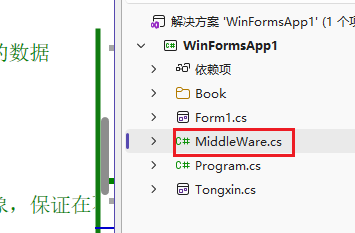 

- 类中定义消息盒子，用于存储一个暗号（Id）和函数（用于接收数据）

  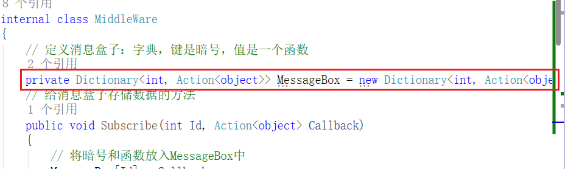 

- 类中定义方法，用于给消息盒子存储数据

  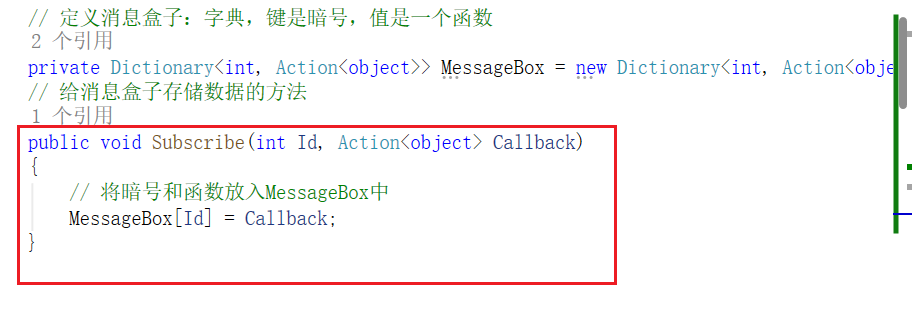 

- 类中定义方法，用于通过暗号（Id）找到函数，方便调用（传递实参）

  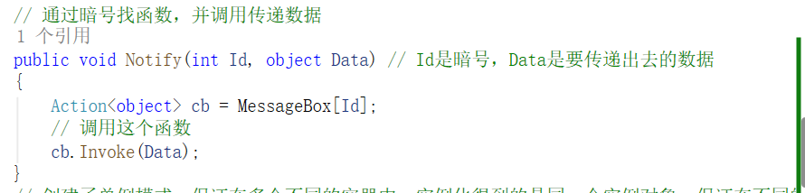 

- 为了保证多个地方使用的是同一个消息盒子，将类做成单例模式（让这个类永远只有一个实例对象）

  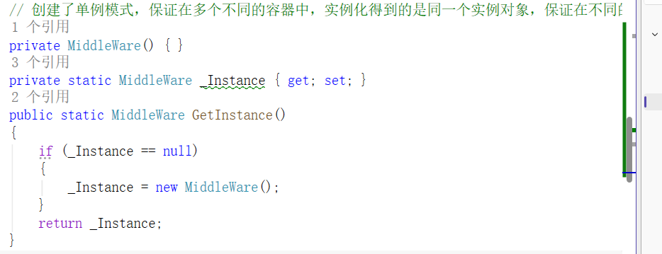 

- 让接收数据的地方，调用类中方法，存储一个暗号和接收数据用的函数

  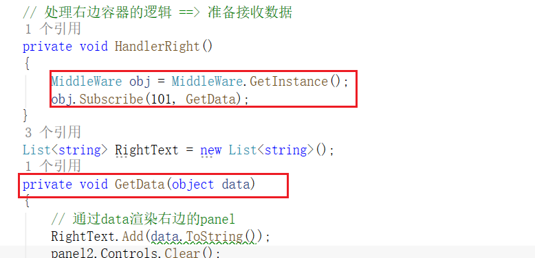  

- 让传递数据的地方，调用方法传递数据，告诉中间人，暗号是多少，数据是什么

  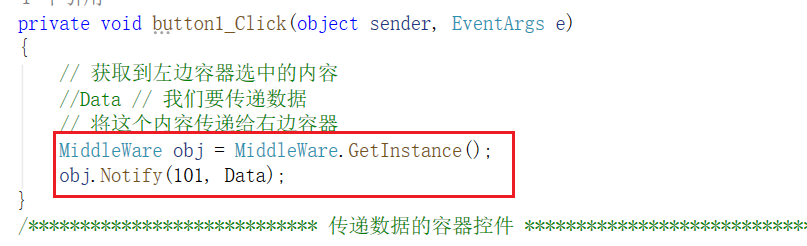 

- 接收方通过函数参数接收到数据后处理逻辑

  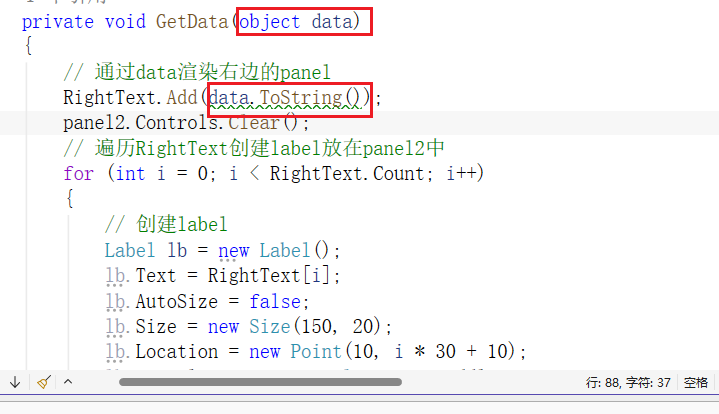 


